# Alan Turing

The Alan Turing website has been created to give an introduction into the life and work of Alan Turing. The site offers small historical overviews of Alan Turing’s life giving the user a timeline of information that lead to Alan Turing being regarded as one of the forefathers of computer programming.  

Users of the site will be able to find external links to various resources such as books and films along with social media links, site feedback survey and newsletter signup. The site is targeted to anyone looking for information on Alan Turing, particularly those looking to research for a historical project. 

[View the live project here](https://donald-macritchie.github.io/alan-turing-history/)

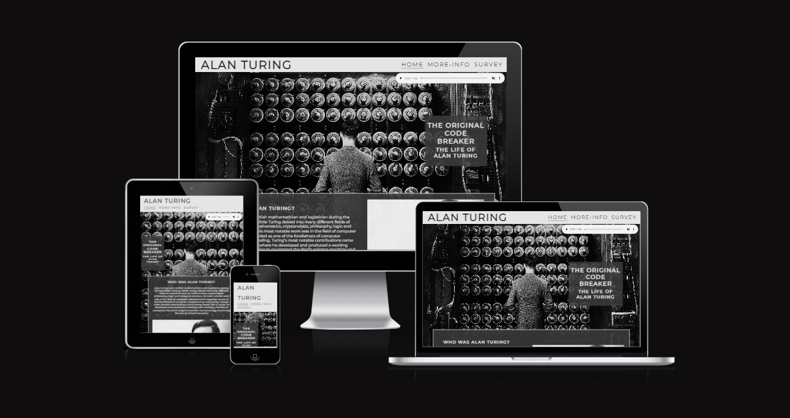

## Features

### Navigation

-	Featured at the top of the page the navigation shows the site name in the top left corner : ALAN TURING where it will link to the home page. 
-	The other three navigation links are located to the top right : HOME links to the same home page, and MORE-INFO and SURVEY to lead the user to separate pages.
-	The navigation clearly leads the user to around the website allowing ease of use and understanding. 
-	The site as a whole has a black and white aesthetic  to tie in with the point in history these events took place i.e. not modern day. 

### Hero Image and Cover Text

-	The hero image displayed is a movie poster from the biopic film “The Imitation Game”, where the character of Alan Turing is standing in front of the bombe machine. 

-	This image along with the cover text immediately gives the user an idea of what the site is about and the aesthetic that will be used throughout. 

-	There is also an audio file of light piano music at top right of the hero image of the home page that can be played whilst viewing. This piano track was selected to help set the mood for the user and provoke an emotional response. 

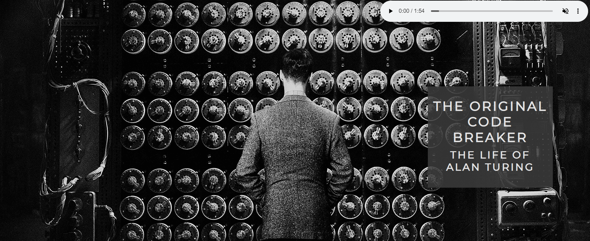

### Home Page

- The home page gives details of the life and work of Alan Turing starting with a brief introduction of who Alan Turing was and why he is such an influential figure in the world of computer programming and the positive impact his work had during World War II.

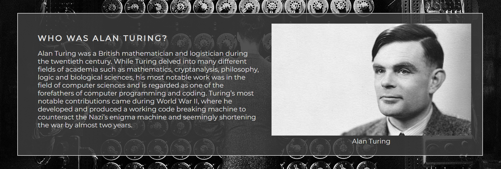

- Continuing on down the home page the user will find more content on different stages of Alan Turing's life such as his Early Life and Education, his work and impact During World War II through to the events surrounding his death.

- The layout of these sections have been kept the same throughout the home page, allowing the user to intuitively understand the structure. 

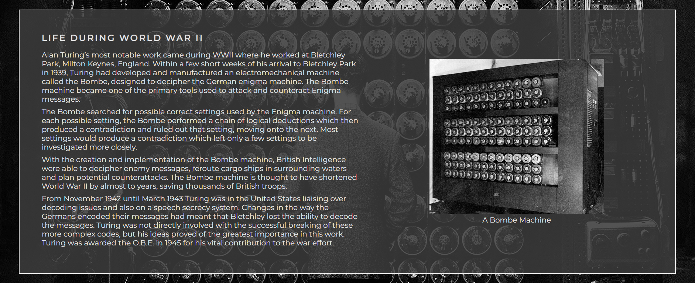

### Footer

-The footer includes relevant social media links for Alan Turing. The links will open on a new tab when clicked to allow for easy naviagtion for the user.

-The footer is valuable to the user as it encourages them to keep up-to-date with various news and publications on the topic.  

### More-Info page

-	The More-info page was designed to give the user further resources to research and investigate if they so desired. 

- The hero image used is a close up image of a Bombe Machine. This is intentionally different to the home page to give a visual que to the user that they have navigated away from the home page.

-	Three books were chosen to display further resource for users to explore if they wish. 
- The book images and texts are working links that will lead to Amazon for the user to purchase. 

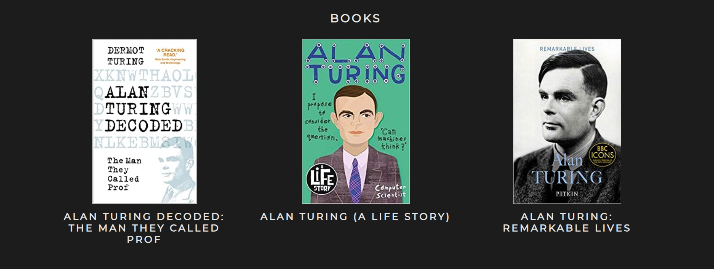

- The film sections follows the same structure as the book section and display three films for the user to explore.

- The film images and text are working links to the respective IMDB profiles on the IMDB site.

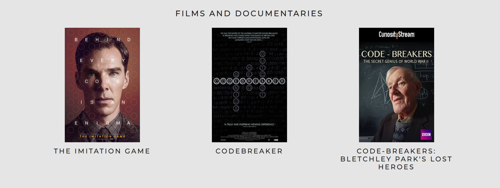

-	The Bletchley park section gives a small piece of information on why this site was relevant to Alan Turing along with a link to the Bletchley park website and a google map showing its existing location.

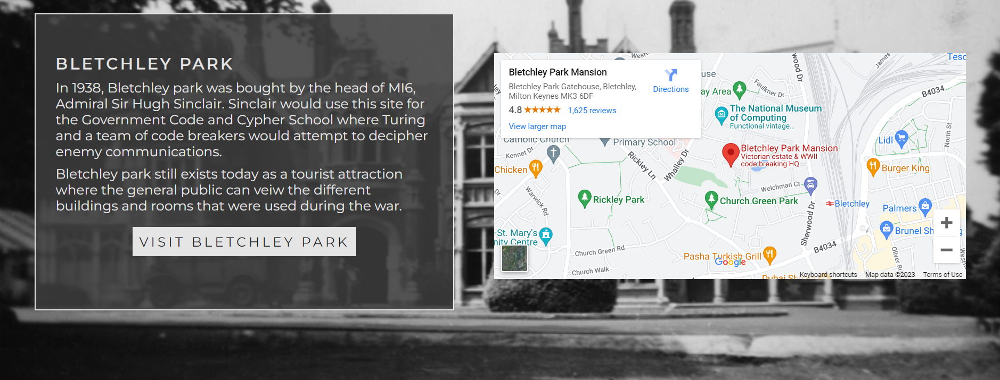

### Survey Page

- The background image used on the survey page is a close up image of an Enigma machine. This is again to give the user a visual que that they have navigated to a different page. 

-	The survey page has a form to collect details regarding the users experience on the page. There are two multiple choice questions as well as a feedback section allowing users to input and send back their thoughts and experience using the site. 

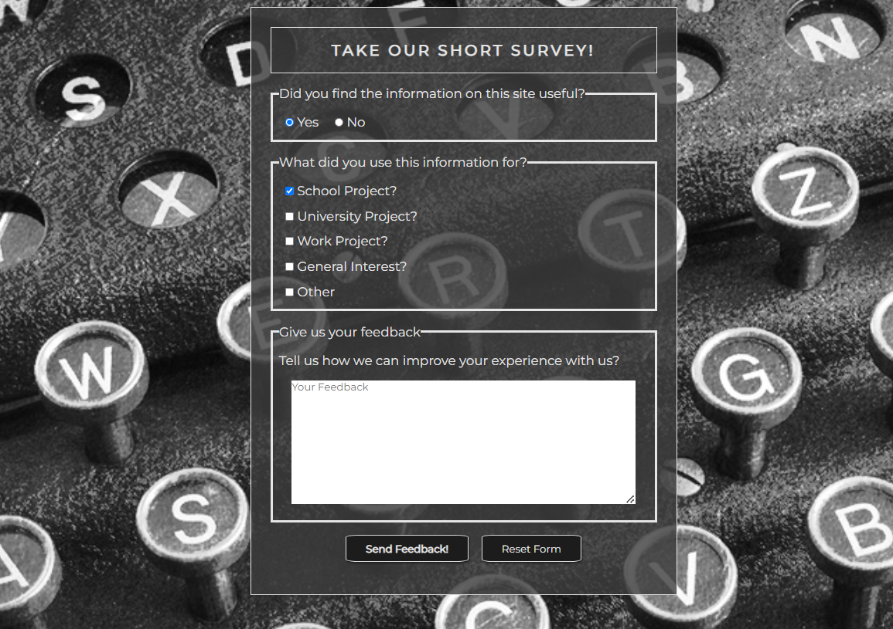

-	At the bottom of the survey page there is a form allowing users to sign up to receive a newsletter. The form collects the users name and email address. This sign up form is valuable as it allows the user to receive further information at a later date. 

## Features Left to Implement

- Ideas to add to implement later is to make navigation up and down the home page smoother. This could entail having each section having navigation links at the top of the page to take the user to each individual section and in turn have a link to take them back to the top. 

## Testing

### Validator Testing

- HTML
  - No Errors were returned when passing through the official [W3C validator](https://validator.w3.org/)

- CSS
  - No errors were returned when passing through the official [(Jigsaw) validator](https://jigsaw.w3.org/css-validator/)

- Accessability
  - I confirmed that the colors and fonts used are easy to read and accessable by running the site through lighthouse in devtools

  - Home page

  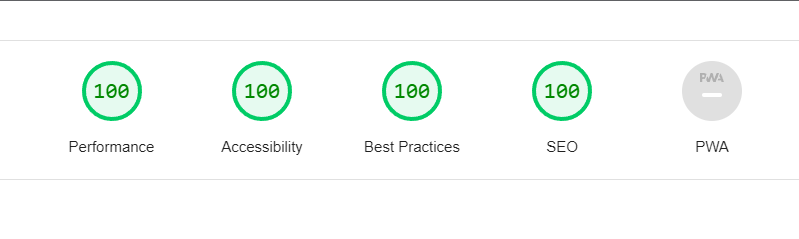

  - More-Info page

  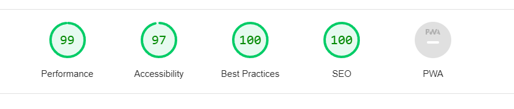

  - Survey page

  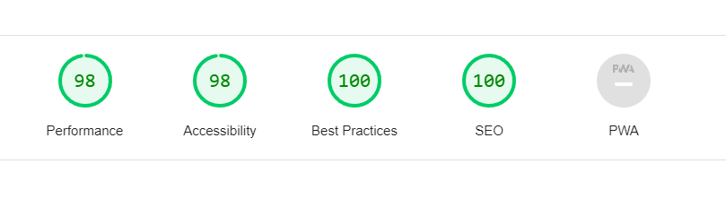

### Bugs

 -	Whilst testing the site on [AM I RESPONSIVE](https://ui.dev/amiresponsive), I discovered the “more” div didn’t act as expected as the div did not stay in the desired position.
 This was fixed in the CSS. 

### Unfixed Bugs

- No unfixed bugs

## Deployment

- The site was deployed using GitHub pages. The steps taken are as follows:

  - In the GitHub repository, navigate to the Settings tab
  - From here, scroll down to and select the Pages sub menu
  - In the source section use the drop down menu and select "main" and click save
  -Once this has been saved, GitHub pages produces a link to follow to the live site. 

- [View the live project here](https://donald-macritchie.github.io/alan-turing-history/)

## Credits

### Code
-	The code to make the header, covertext and social media links were taken from the CI Love Running project.
- Grid styling was taken from [Net Ninja youtube channel](https://www.youtube.com/@NetNinja)

### Information
The Historical information was taken from numerous online resources. The links can be found below:

https://www.biography.com/scientists/alan-turing
https://www.britannica.com/biography/Alan-Turing
https://bletchleypark.org.uk/
https://www.britannica.com/place/Bletchley-Park
https://www.nytimes.com/2019/06/05/obituaries/alan-turing-overlooked.html
https://en.wikipedia.org/wiki/Alan_Turing

### Media

### Audio

The audio file was taken from YouTube audio library.

Title – Allegro.
Artist – Emmit Fenn.

### Images

 - [Home hero image](https://www.pxfuel.com/en/desktop-wallpaper-xihnq)

 - [Home1](https://www.gchq.gov.uk/images/alan_turing.jpg)

 - [Home2](https://upload.wikimedia.org/wikipedia/commons/a/a1/Alan_Turing_Aged_16.jpg)

 - [Home3](https://upload.wikimedia.org/wikipedia/commons/thumb/7/7a/Wartime_picture_of_a_Bletchley_Park_Bombe.jpg/330px-Wartime_picture_of_a_Bletchley_Park_Bombe.jpg)

 - [Home4](https://www.britannica.com/biography/Alan-Turing)

 - [Home5](https://d2joqs9jfh6k92.cloudfront.net/wp-content/uploads/2018/01/15175155/Alan-Turing-Memorial-Manchester-England.jpg)

 - [More Info hero image](https://bletchleypark.org.uk/wp-content/uploads/2022/01/6FactsBombe_945x805-805x805.jpg)

 - Books
   - Book cover images were taken directly from Amazon.com respective product pages.
   - [Alan Turing Decoded](https://www.amazon.co.uk/Alan-Turing-Decoded-They-Called/dp/0750998679/ref=sr_1_1_sspa?crid=2TKQFDJLV7MOL&keywords=alan+turing&qid=1677240133&s=books&sprefix=alan+turing%2Cstripbooks%2C86&sr=1-1-spons&sp_csd=d2lkZ2V0TmFtZT1zcF9hdGY&psc=1)
   - [Alan Turing (A Life Story)](https://www.amazon.co.uk/Alan-Turing-Story-Joanna-Nadin/dp/1407193198/ref=sr_1_6?crid=2TKQFDJLV7MOL&keywords=alan+turing&qid=1677240133&s=books&sprefix=alan+turing%2Cstripbooks%2C86&sr=1-6)
   - [Alan Turing: Remarkable Lives](https://www.amazon.co.uk/Alan-Turing-Dermot/dp/1841658774/ref=sr_1_9?crid=2TKQFDJLV7MOL&keywords=alan+turing&qid=1677240133&s=books&sprefix=alan+turing%2Cstripbooks%2C86&sr=1-9)

 

- Films and Documentaries

  - Film and documentary images were taken from the respective IMDB profile pages. 
  - [The Imitation Game](https://www.imdb.com/title/tt2084970/?ref_=ttls_li_tt)
  - [Codebreaker](https://www.imdb.com/title/tt2119396/?ref_=ttls_li_tt)
  - [Code-breakers: Bletchley Park's lost heroes](https://www.imdb.com/title/tt2491866/?ref_=ttls_li_tt)

 

 - [Bletchley Park - background image](https://www.gchq.gov.uk/section/history/bletchley-park-and-wwii)

 - [Survey hero image](https://media.kasperskydaily.com/wp-content/uploads/sites/86/2015/05/05195343/Enigma.png)

### README.md

- This README.md File was created using the [Code Institute Love Running README.md template](https://ui.dev/amiresponsive) and using tips from the "Creating a README" file created by [Kera Cudmore](https://github.com/kera-cudmore)